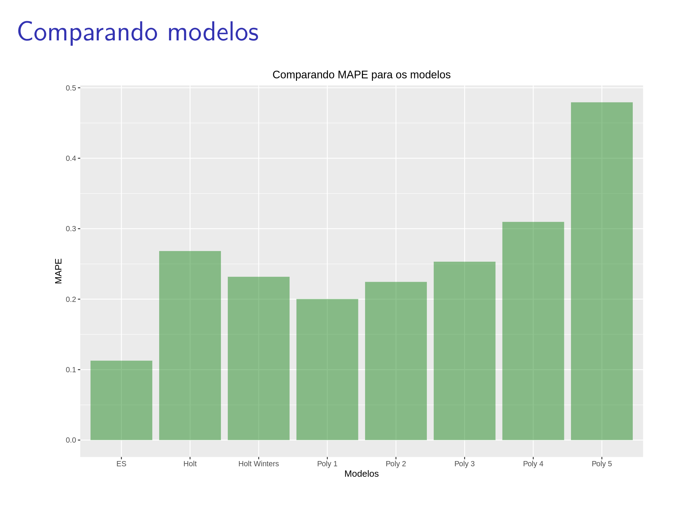

# Time Series 

Time series is a series of data points indexed in time order. Mathematically,
a time series is a stochastic process with a discrete-time observation
support. In this repository, we study several topics included in this topic,
as ARIMA models, trend and seasonality. Each homework has a pratical study and
some theorical questions. 

The homeworks and assigments are coded in R language and the presentations and
texts are in portuguese. If requested, the author can translate it. 

## Homework 1 

A pratical study of Car's Sales in Norway. In this study we practice the
following modelling: 

- Decomposition in [Seasonal, Trend and Remainder](https://otexts.com/fpp2/stl.html) of a Time Series. 
- Polynomial regression for trend and seasonality. 
- Holt Winters and Exponential Smoothing 

After each modelling, we compared the models using the [Mean Absolute
Percentage
Error](https://en.wikipedia.org/wiki/Mean_absolute_percentage_error). 

Above you can see the moving average decomposition and the final comparison
among the models. 

## Homework 2
